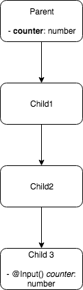
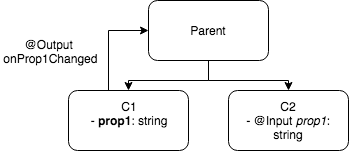
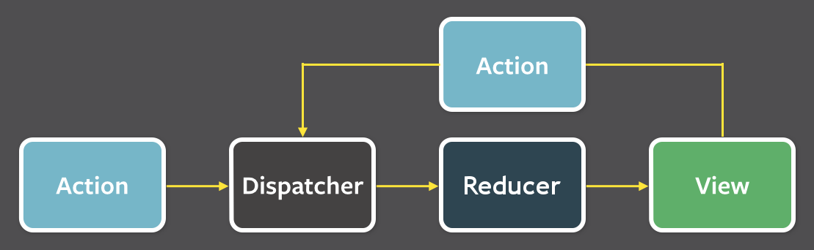

title: State management in Angular
class: animation-fade
layout: true

<!-- This slide will serve as the base layout for all your slides -->
.bottom-bar[
  {{title}}
]

---

class: impact no-counter

# {{title}}
## Mario Fernandez

---

# What is state management?

.scaled-image.center[
  
]

---


# Disclaimer

I am a declared _React_ fan

--

Probably unqualified to provide too many opinions on _Angular_

--

Will do so anyway

---

class: impact no-counter

# Context

---

```bash
commit 4db543c897d44849eb073facfe1562a156b02137
Author: Frontend Dev
Date:   Sun Oct 30 21:10:48 2016 +0100

    Initial commit

```

---

.center[
  
]

---

.center[
  
]

---

.scaled-image.center[
  
]

---

class: impact no-counter

# Patterns

---

class: transition

# Input/Output

---

# What

--

Most components do not hold their own state ()

--

Instead, they receive their data as `@Input`, and trigger changes upstream with `@Output`

--

Presentational Components, Dumb Components, Functional Components

---


## Example

```typescript
class SimpleComponent {
  @Input() selectedDate: Date;
  @Output() onJump = new EventEmitter<Date>();

  jumpBack(date: Date) {
    this.onJumpto.emit(date);
  }
}
```

---

class: slogan

## That's it, problem solved

---

class: slogan no-counter

## End

---

class: slogan no-counter

## Maybe not

---

# The input train

.center[
  
]

---

# The sideways state

.lateral-state.center[
  
]

---

class: impact no-counter

# Let's take a break to talk about bad ideas

---

class: transition

# ViewChild

---

# What

--

A way to bind a child component to a variable

--

Access the child's component state directly

---

```typescript
class Evil {
  @ViewChild(PoorChildrenComponent)
  sayGoodbyeToEncapsulation: PoorChildrenComponent; 

  beEvil() {
    this.sayGoodbyeToEncapsulation.changeStuffExternally();
  }
}
```

---

class: slogan

## Break encapsulation

---

class: slogan no-counter

## Couple components forever

---


.center[
  
]

---

class: transition

# Nested Forms

---

# What

--

Combine multiple forms

--

Treat them as one

---

```html
  <!-- Parent component template -->
  <child-component
    [parentForm]="formGroup">
```

---

```typescript
class ChildComponent implements OnInit {
  @Input() parentForm: FormGroup
  
  ngOnInit() {
    this.parentForm.setControl('stuff', this.myControl);
  }
}
```

---

```typescript
class ParentComponent implements OnInit {
  formGroup: FormGroup
  
  youWontLikeThis() {
    this.formGroup.get('stuff').setValue('surprise!');
  }
}

```

---

class: transition

# Service as a Global

---

```typescript
@Injectable()
export class GlobalService {
  stuf: string
  moreStuff: string
}
```

---

.center[
  
]

---

class: impact no-counter

# Back to more reasonable practices

---

class: transition

# ngrx-store

---

# What

--

`Redux` for angular

--

.center[
  
]

---

# The harsh reality of introducing _Redux_

- _Redux_ is not the easiest library to explain, specially to developers without a frontend background
- Incremental adoption is problematic

--

- To say the least

---

class: transition

# Data Services

---

# What

A _Service_ that:

- holds data
- offers an API to manipulate it
- provides a way to get notified of updates

---

## A simple service

```typescript
@Injectable()
export class Store {
  private timeslotSubject = new BehaviorSubject<string>(null);
  timeslot$ = this.timeslotSubject.asObservable();

  selectTimeslot(timeslot: string) {
    this.timeslotSubject.next(timeslot);
  }
}

```

---

## Changing the state

```typescript
class Publisher implements OnInit {
  constructor(private store: Store) {}
  
  onSelection(ts: string) {
    this.store.selectTimeslot(ts);
  }
}
```

---

## Getting updates

```typescript
class Subscriber implements OnInit {
  timeslot: string
  
  constructor(private store: Store) {}
  
  ngOnInit() {
    this.store.timeslot$
      .filter(ts => !!ts)
      .subscribe(ts => this.timeslot = ts)
  }
}
```

---

class: impact no-counter

# Summary

---

# Learnings

- `Angular` offers many shortcuts that can be easily misused
- **Discipline** is needed to keep your app under control
- _Data Services_ seem to be the most accepted pattern
- _Input/Output_ work as well, specially for simple apps

---

# Links

- https://hceris.com/angular-from-react-part1/
- https://angular.io/guide/component-interaction#parent-and-children-communicate-via-a-service
- https://blog.angular-university.io/how-to-build-angular2-apps-using-rxjs-observable-data-services-pitfalls-to-avoid/

---

class: impact no-counter

# Thank you!
## Questions?

